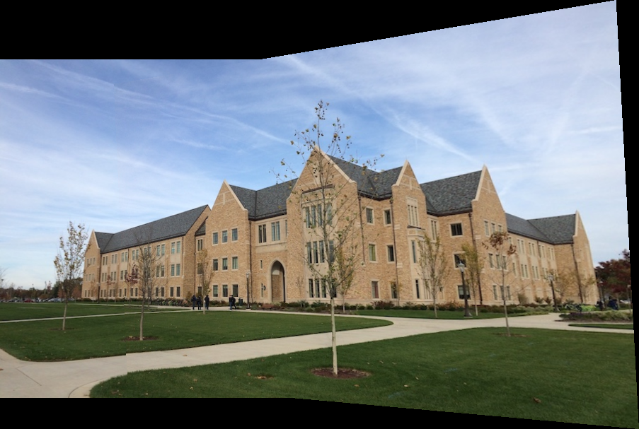
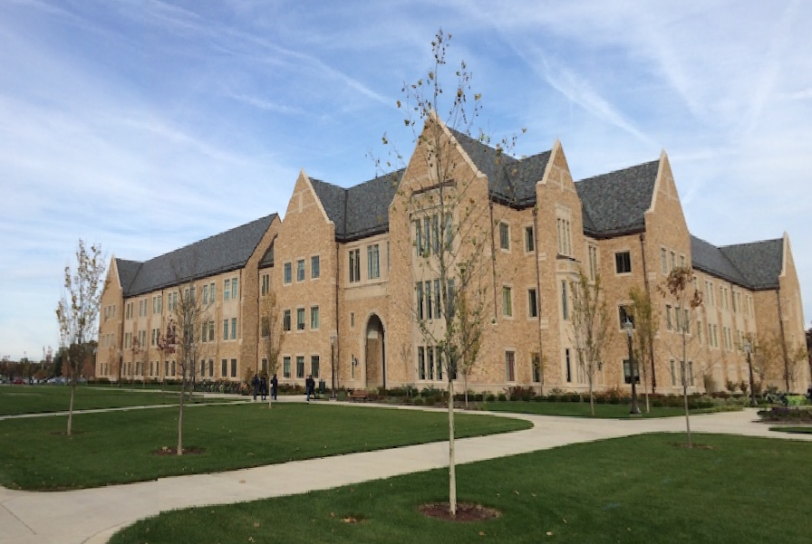
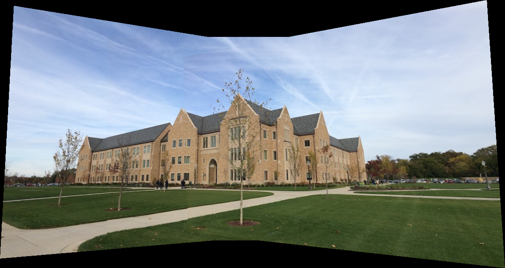

# Introduction
This project is designed to demonstrate the capabilities of automated image stitching using MATLAB. Image stitching is the process of
combining multiple photographic images with overlapping fields of view to produce a segmented panorama or high-resolution image composite. 
The primary objective of this project is to develop an algorithm that seamlessly stitches together three separate images—left, middle,
and right—into a single panoramic image. This is achieved by identifying keypoints in each image, matching these points between images,
and using geometric transformations to align and blend these images smoothly.

# Implementation
1. The project utilizes the SURF algorithm to detect unique features in each image, facilitating accurate alignment.
2. After keypoints are detected, corresponding features between consecutive images (left-middle, right-middle) are matched using a feature matching algorithm.
3. With matched keypoints, projective transformations are calculated to align the images relative to the middle image, which serves as the stitching baseline.
4. The images are then warped to align them in a common coordinate system, and alpha blending techniques are used to ensure the transitions between stitched images are smooth and visually appealing.

# Results
## Task 1
Below is the panorama for the left and middle image

Here is the image after inverse warping

## Task 2
Below is the generated panorama using the left image as the reference inverse warping

## Task 3
### Answer
The right image appears deformed because the left image is used as the reference and the right image is the farthest from it. This
deformation occurred because errors in transformation matrices are compounded when transmitted across multiple images. To address this,
we shifted the reference point to the middle image, reducing error propagation and achieving a more uniform and visually coherent
stitched panorama.

Here are the resulting images when the middle image is used as our reference:

## Task 4

Below are the output of running Task 2 and Task 3 on my own images

